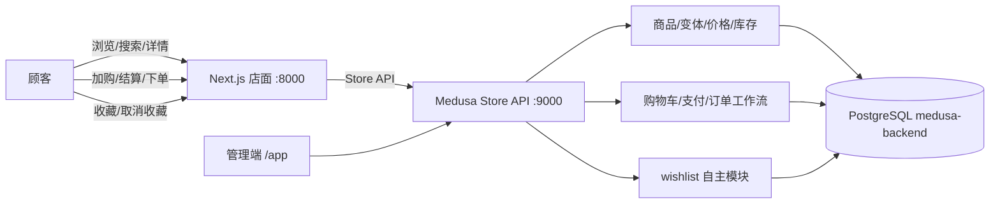

# 实验报告：开源在线商城系统二次开发

**课程**：《开源软件与新技术》（230518255，2026 年版）
**实验编号**：EXPERIMENT 02 —— 开源在线商城系统二次开发
**基线**：DTC Starter Commit `19e8a6fbe5fea5a385e9502409908bfbebbecf526`（Medusa 2.20.1，pnpm 10.11.1）
**分支**：`feature/store-extension`
**完成方式**：每人独立完成（本报告为个人开发记录）

---

## 1. 需求分析

### 1.1 问题场景

在线商城把目录、价格、库存、购物车、客户和订单连接成一条有状态的业务链。
本实验要求以成熟开源项目（Medusa DTC Starter）为基线完成可辨识的二次开发：
跑通「浏览 → 购物车 → 结算 → 下单」全链路，管理端可查到订单，数据重启后仍
存在；同时至少实现一项与真实业务数据关联的扩展（本实验选择**登录用户收藏夹**），
并补齐测试、Git 过程证据与 5–10 分钟 PPT。

### 1.2 功能需求（MVP + 完整版）

| 需求 | 要求 | 本实验完成情况 |
|---|---|---|
| 健康检查/三入口 | 后端 `/health`、管理端 `/app`、店面 `/dk` 可访问 | ✅ 全部 200 |
| 商品浏览 | 列表、搜索、详情、分类 | ✅ 10 商品、搜索、详情含价格 |
| 购物车 | 加购、改数量、删行 | ✅ 变体级加购，数量/删除均验证 |
| 结算下单 | 填地址 → 配送 → 支付会话 → 完成订单 | ✅ 订单 `order_01M2F0PSZDG5TWCFERQ36G16D5`（#1, €1620 EUR, authorized） |
| 管理端 | 可查看商品与刚创建订单 | ✅ `/app/orders` 可见订单 #1 |
| 持久化 | 重启后商品/购物车/订单仍在 | ✅ PostgreSQL 持久；集成测试快照隔离 |
| 边界 | 缺货、超量、无效输入、重复提交 | ✅ 库存边界套件 8 用例 |
| 自主功能 | 真实持久化 + 失败状态 | ✅ 收藏夹（`wishlist_item` 表 + 401/400/幂等 + UI 跳转） |

### 1.3 拓展功能（自主设计，Issue #1）

**登录用户收藏夹及跨设备同步**。选择理由：收藏是电商"暂存区"典型业务，数据
归属清晰（客户数据）、接口简单但完整覆盖鉴权/幂等/失败态，且能体现"后端持久化
数据驱动 UI"而非静态页面。跨设备同步由后端存储天然支持（收藏不在浏览器本地）。

---

## 2. 总体架构



- 店面只负责交互与错误展示；价格、库存、订单规则由后端决定。
- 商品**变体**是购物车数量与库存的直接对象（加购传 `variant_id`）。
- 结算是多步骤工作流；刷新/重试不会创建重复订单（complete 幂等）。
- 自主模块走 Medusa API/模块扩展点，未修改 node_modules 或核心框架。

---

## 3. 环境与初始化

| 组件 | 实际版本/端口 | 用途 |
|---|---|---|
| Node.js | v20 LTS 系列 | 后端、管理端、店面 |
| pnpm | 10.11.1 | Monorepo 锁文件 |
| PostgreSQL | 16.9 / 5432（服务 postgresql-x64-16） | 库 `medusa-backend`，角色 `medusa` |
| Redis | 6379（便携版） | 事件/缓存（本地实验） |
| Medusa 后端 | 9000 | API + 管理端 |
| Next.js 店面 | 8000 | Storefront |

初始化命令（相对 DTC 根目录，Windows PowerShell）：

```powershell
git clone https://github.com/medusajs/dtc-starter.git
Set-Location dtc-starter
git switch --detach 19e8a6fbe5fea5a385e9502409908bfbebbecf526
git switch -c feature/store-extension
pnpm install --frozen-lockfile
Copy-Item apps/backend/.env.template apps/backend/.env
# 编辑 apps/backend/.env：DATABASE_URL / JWT_SECRET / COOKIE_SECRET / CORS
Set-Location apps/backend
pnpm exec medusa db:migrate          # 含 initial-data-seed（区域/配送/4 商品）
pnpm exec medusa user -e admin@medusa-lab.test -p Lab2026admin
pnpm dev                              # 后端 9000
# 另开终端：
Set-Location apps/storefront
Copy-Item .env.template .env.local    # 填入 Publishable Key / NEXT_PUBLIC_MEDUSA_BACKEND_URL
pnpm dev                              # 店面 8000
```

实验商品种子（幂等，新增 6 个 → 共 10 个，含边界库存）：

```powershell
Set-Location apps/backend
pnpm exec medusa exec ./src/scripts/seed-lab-products.ts
```

边界库存设计：零库存（BEANIE-BLACK=0、SOCKS-3PACK=0）、仅剩 1 件
（HOODIE-LTD-M=1）、多规格（水瓶 750ML=40/1L=25、帽子 S/M/L）等。

---

## 4. 实现

### 4.1 主链路（上游基线，本次完成联调与验证）

- 商品列表/搜索/详情：`GET /store/products`（含 `q=`、`region_id`、`fields`）
- 购物车：`POST /store/carts` → `line-items` → 改数量/删行
- 结算：`/store/carts/{id}`（地址）→ `/store/shipping-options?cart_id=` →
  `shipping-methods` → `/store/payment-collections` → `payment-sessions`
  （`pp_system_default` 手工支付）→ `POST /store/carts/{id}/complete`
- 管理端：`/app/orders` 可查订单 #1

关键 API 契约与响应摘要见 `docs/store-api.md`。

### 4.2 自主功能：收藏夹（Wishlist）

**后端**（3 个文件 + 迁移 + 配置注册）：

- `apps/backend/src/modules/wishlist/models/wishlist.ts`：`wishlist_item`
  （`id/customer_id/product_id`，均 searchable）；迁移
  `Migration20260914035612` 建表。
- `service.ts`：`MedusaService` 派生标准 CRUD。
- `apps/backend/src/api/store/wishlist/route.ts`：
  - `GET`：按 `customer_id` 取当前顾客收藏（created_at DESC）；
  - `POST`：幂等——已存在返回 `{wishlist, already_exists:true}`，新建 201；
    缺 `product_id` 400；
  - `DELETE /:product_id`：不存在时 no-op 成功（幂等）；
  - 中间件 `authenticate("customer", ["session","bearer"])`，取
    `req.auth_context?.actor_id`。

**店面**（Server Actions + UI）：

- `src/lib/data/wishlist.ts`：`getWishlist`/`addToWishlist`/`removeFromWishlist`
  经 Medusa SDK 调 `/store/wishlist`；缓存 tag `wishlist`，增删后 revalidate；
  匿名返回 `auth_required`。
- `wishlist-button.tsx`：详情页心形按钮，`useOptimistic` 乐观切换；匿名点击 →
  跳转 `/account?wishlist=1`。
- `[countryCode]/(main)/wishlist/page.tsx`：收藏列表（价格/缩略图/移除）、
  空态、未登录跳转。
- 导航栏增加 Wishlist 链接；商品详情模板集成按钮（async 预取收藏态）。

### 4.3 失败处理与幂等

| 场景 | 处理 |
|---|---|
| 零库存加购 | 400（无库存位置/零库存被拦截），购物车不残留 |
| 数量 0/负/超量 | 400；被拒后行项目回滚（`items=[]`） |
| 重复提交订单 | 200 + 同一订单 ID；DB 仅 1 条订单 |
| 删除不存在行项目 | 幂等 no-op |
| 无效地址 | 结算工作流按字段校验报错 |
| 匿名收藏 | UI 跳转登录页，后端 401 |
| 商品下架 | 收藏记录保留，收藏页 JOIN 不到商品则自动隐藏该项 |

---

## 5. 测试

测试方式：Medusa 官方 `medusaIntegrationTestRunner`（每个用例前数据库快照恢复，
用例自包含）。命令（Windows PowerShell）：

```powershell
cd apps/backend
$env:TEST_TYPE='integration:http'
$env:NODE_OPTIONS='--experimental-vm-modules'
pnpm exec jest --silent=false --runInBand --forceExit
```

结果：**3 个套件、27 个用例全部通过**（`Test Suites: 3 passed` / `Tests: 27 passed`）：

| 套件 | 数量 | 覆盖 |
|---|---|---|
| `http/wishlist.spec.ts` | 10 | 401×2、空列表、加购 201、幂等、400、列表≥3、删除、no-op、DB 持久化 |
| `http/storefront-flow.spec.ts` | 9 | 浏览、搜索、详情价、建车、加行、结算下单、订单查询、DB 持久化、库存预留 |
| `http/inventory-boundary.spec.ts` | 8 | 零库存整品/变体、仅剩 1 件、超量、100 件超限、被拒后空车、草稿下架、重复下单幂等 |

API 级证据：
- `_agent_output/06-store-flow.txt`：主链路请求/响应摘要 + 订单号
  `order_01M2F0PSZDG5TWCFERQ36G16D5`
- `_agent_output/07-wishlist-api.txt`：收藏接口全流程（未登录 401、注册登录、
  空列表、幂等、400、删除、no-op）
- `_agent_output/jest-all2.txt`：集成测试完整运行输出

空数据库重建演示数据：集成测试运行器每次在全新测试库执行种子 → 等价于
「清空全新数据库 + README 初始化流程」的可重复验证；另提供 `reset-db.bat`
在真实库重建。

### 测试过程发现并解决的问题（摘录）

1. **渠道不一致导致列表缺商品**：测试库同时存在核心自建 "Medusa Store" 与种子
   "Default Store"，店面列表只取首 store 渠道 → `seedStore` 把全部商品、
   Publishable Key、库存位置统一链接到首 store 渠道。
2. **金额/数量断言**：`query.graph` 返回 BigNumber 对象，需 `Number()` 归一化；
   订单行项目数量从 `order.items` 关系读取。
3. **重复提交语义**：二次 complete 返回 200 + 同一订单是 Medusa 实际行为，
   断言改为"同一订单 ID + 数据库仅 1 条"。
4. **搜索索引**：测试内 q 搜索索引异步填充，beforeAll 轮询等待后再快照。

---

## 6. Git 过程证据

分支 `feature/store-extension`，基线之上 **5 个可解释的非合并提交**（覆盖
基线配置、核心功能、自主功能、测试、文档）：

```text
c38eacc test(backend): integration suites for wishlist, storeflow, inventory
2e2da2b feat(storefront): wishlist UI end to end
20a4da6 feat(backend): wishlist module and store API
c799fda feat(backend): seed 6 lab products with boundary inventory
2be0937 chore(root): allow pnpm postinstall for native deps
19e8a6f chore: update @medusajs/* to v2.20.1 (#58)   ← 固定基线
```

- Issue：#1（收藏夹）、#2（测试）、#3（文档）→ `docs/issues.md`
- PR 自审：#1 feature/store-extension → main，10 项检查清单逐项核验 +
  发现并修复 4 类问题 → `docs/pr-review.md`
- 完整图证据：`_agent_output/git-evidence.txt`
  （`git log --oneline --graph --decorate --all -n 30` 与 `git shortlog -sne HEAD`）

---

## 7. 问题与反思

### 7.1 遇到的问题与解决

| 问题 | 根因 | 解决 |
|---|---|---|
| 命令通道 `GetPathRoot 非法字符` | 系统 PATH 残留两条带引号的坏条目 | 提权修复脚本清理 PATH，重启豆包后恢复 |
| `D:\oss-mall` 无写权限 | 目录 ACL 缺少当前用户 | .NET FileSystemAccessRule 授权 |
| 添加 wishlist 路由后后端 9000 掉线 | 相对导入路径错误致注册 API 失败 | 修复导入层级并重启 |
| 加购返回 400 | 传入商品 ID 而非变体 ID / 渠道-库存位置未关联 | 用变体 ID；seedStore 对齐渠道 |
| 店面没有商品 | 销售渠道/发布状态/库存位置未配置完整 | 管理端逐项核对 + Network 面板验证 |
| 集成测试用例互相污染 | runner 每个用例前恢复快照 | 用例全部自包含，种子放 beforeAll |

### 7.2 取舍与未解决风险

- **收藏不预留库存**：收藏与购物车解耦，收藏页展示实时价格；库存为 0 仍可收藏，
  加购时由订单工作流拦截（已测）。
- **本地仓库无远程**：Issue/PR 以 Markdown + Commit 关联记录，未推送 GitHub；
  教师可据 `git log`/自审记录核对过程。
- **`.env.test` 提交入库**：仅含实验专用本地凭据；对外发布前应替换占位符
  （NOTICE.md 已注明）。
- **搜索接口依赖 free-text-search**：未启用 index-engine 时 q 搜索走
  free-text-search，已通过测试验证；生产建议启用索引引擎。
- **未接真实支付**：按实验要求使用 `pp_system_default` 手工支付，验收以本地
  订单对象创建且管理端可见为准。

### 7.3 思考题

1. **为什么购物车对象是商品变体而非商品？** 价格、库存、规格（尺寸/颜色）都
   挂在变体上；商品是聚合根，本身不可购买。加购/库存校验/计价都按变体进行，
   传商品 ID 必然 400（本实验实测复现）。
2. **销量排行应基于已创建、已支付还是已完成订单？** 口径决定语义：已创建含
   未支付（可能弃购，高估）；已支付含退款（需再减）；已完成最接近"真实成交"，
   但回填慢。应明确口径并在页面注明；本实验订单为 authorized 支付集合，
   排行类功能应声明"按已支付订单"。
3. **如何不用分布式事务减少库存与订单不一致？** 下单前在工作流内预留库存
   （reservation），完成订单时扣减；失败时回滚预留；重复提交用幂等键/同一
   cart 返回同一订单；并发超卖由库存模块的行级预留保证（本实验 100 件超限
   用例验证）。
4. **直接修改核心 vs 模块/工作流扩展的成本差别？** 改核心（node_modules/
   包源码）每次重装丢失、无法跟随上游升级、diff 不可维护；用模块/API/工作流
   扩展点改动可提交、可测试、随版本平滑迁移。本实验全部改动位于
   `src/api`、`src/modules`、`src/scripts`、店面 `src`，符合后者。

---

## 8. 总结

本实验围绕电商状态链完成开源商城的运行与二次开发：以固定 Commit 的 DTC
Starter 为基线，跑通浏览→购物车→结算→下单全链路（订单 #1 管理端可查），
自主实现基于后端持久化的收藏夹（含鉴权、幂等、失败态、跨会话同步），补齐
27 个集成测试、5 个 Git 提交、Issue/PR 自审记录、README 与一键启停脚本，
并通过浏览器实测与截图形成课堂演示材料。核心收获：界面成功提示不能替代后端
业务一致性；固定依赖、迁移、种子数据与许可证边界是开源二次开发的基本盘。

---

## 附：交付物清单

| 交付物 | 位置 |
|---|---|
| 源码与 Git 证据 | `D:\oss-mall\dtc-starter`（分支 feature/store-extension） |
| README（含架构图/启停/测试/截图） | `D:\oss-mall\dtc-starter\README.md` |
| Store API 摘要 | `D:\oss-mall\dtc-starter\docs\store-api.md` |
| 业务规则决策记录 | `D:\oss-mall\dtc-starter\docs\decision-record.md` |
| Issue / PR 自审记录 | `D:\oss-mall\dtc-starter\docs\issues.md`、`docs\pr-review.md` |
| 许可证说明 | `D:\oss-mall\dtc-starter\NOTICE.md` |
| 一键启停/重置脚本 | `D:\oss-mall\scripts\start-all.bat`、`stop-all.bat`、`reset-db.bat` |
| 测试/运行证据 | `D:\oss-mall\_agent_output\`（jest-all2.txt、06/07-store/wishlist、git-evidence.txt） |
| 演示截图 | `D:\oss-mall\_agent_output\ppt-*.png` |
| 课堂 PPT | `D:\oss-mall\实验02-开源在线商城系统二次开发-演示.pptx` |
